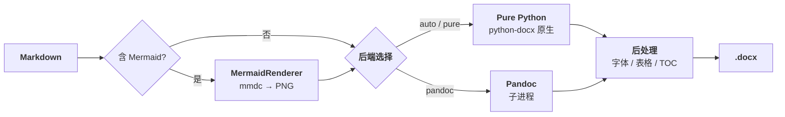

# DOCX Pipeline

[](https://github.com/redamancy231-create/docx-pipeline/actions/workflows/ci.yml)
[](https://pypi.org/project/docx-pipeline/)
[]()
[]()

[English](./en/README.md) · [正體中文](./zh-Hant/README.md)

> **English Abstract**: DOCX Pipeline converts Markdown to production-quality Chinese DOCX files. It offers a dual backend (Pure Python via python-docx + Pandoc subprocess), automatic Mermaid diagram rendering, and 4 preset templates covering general documents, academic papers, technical reports, and quantitative strategy documents. Fonts, sizes, margins, line spacing, and table styles are fully configurable via YAML. Tested across 3 rounds of independent LLM review with 17 automated tests passing.



将 Markdown 文档转换为高质量 DOCX 文件的命令行工具。支持 python-docx 原生生成和 pandoc 双后端，内置 Mermaid 图表渲染，提供 4 套预设中文模板。

## 目录

- [简介](#简介)
- [安装](#安装)
- [快速开始](#快速开始)
- [命令参考](#命令参考)
- [配置说明](#配置说明)
- [模板说明](#模板说明)
- [示例](#示例)
- [注意事项](#注意事项)
- [项目结构](#项目结构)

## 简介

DOCX Pipeline 解决 Markdown 转 Word 文档时中文排版失控的痛点。双后端架构让你可以：

- **python-docx 后端**：精细控制字体、字号、行距、首行缩进、表格样式等中文排版要素
- **pandoc 后端**：利用 pandoc 成熟的 Markdown 解析和代码高亮能力，适合复杂技术文档
- **Mermaid 集成**：自动检测 Mermaid 代码块并渲染为图片嵌入
- **模板系统**：4 套预设模板覆盖通用文档、学术论文、技术报告、量化策略场景

## 安装

### 依赖

| 组件 | 必需 | 说明 |
|------|------|------|
| Python 3.10+ | 是 | 运行环境 |
| pandoc | 否 | 可选后端，`pandoc.enabled=true` 时需要 |
| mermaid-cli (@mermaid-js/mermaid-cli) | 否 | Mermaid 图表渲染，`mermaid.enabled=true` 时需要 |

### 安装步骤

```bash
# 1. 安装 docx-pipeline（自动安装 python-docx、PyYAML、click、Pillow）
pip install git+https://github.com/redamancy231-create/docx-pipeline.git

# 2. (可选) 安装 pandoc
# Windows: choco install pandoc  或从 https://pandoc.org/ 下载安装
# macOS: brew install pandoc
# Linux: sudo apt install pandoc

# 3. (可选) 安装 mermaid-cli
npm install -g @mermaid-js/mermaid-cli
```

## 快速开始

### 初始化项目配置

```bash
# 使用默认模板在当前目录创建配置文件
docx-pipeline init --project-dir ./my-project

# 指定模板类型
docx-pipeline init --project-dir ./my-project --template academic

# 指定项目名称
docx-pipeline init --project-dir ./my-project --template report --name "技术报告"
```

### 转换 Markdown 为 DOCX

```bash
# 使用当前目录的 project.yaml 转换
docx-pipeline convert --config ./project.yaml

# 指定输出文件
docx-pipeline convert --config ./project.yaml --output ./output/report.docx

# 使用 pandoc 后端
docx-pipeline convert --config ./project.yaml --method pandoc

# 预览模式（不实际生成文件）
docx-pipeline convert --config ./project.yaml --dry-run
```

## 后端对比 | Backend Comparison

| Feature | Pure Python | Pandoc |
|---------|:-----------:|:------:|
| Headings (h1-h6) | ✅ | ✅ |
| Tables | ✅ | ✅ |
| Code blocks (with highlighting) | ✅ (no syntax highlight) | ✅ (with syntax highlight) |
| Inline code | ✅ | ✅ |
| Bold / Italic | ✅ | ✅ |
| Blockquotes | ✅ | ✅ |
| Images | ✅ (embedded) | ✅ (embedded) |
| Lists (ordered/unordered) | ✅ | ✅ |
| Horizontal rules | ✅ | ✅ |
| YAML frontmatter | ✅ (skipped) | ✅ (skipped) |
| Mermaid diagrams | ✅ (pre-rendered PNG) | ✅ (pre-rendered PNG) |
| Table of Contents | ✅ (field code) | ✅ (`--toc` flag) |
| Chinese typography post-processing | ✅ | ❌ (needs reference docx) |
| External dependencies | None (standard); Node.js + mermaid-cli (Mermaid) | pandoc |
| Output file size | Typically smaller | Typically larger (embeds resources) |

## 何时选择哪个后端 | When to Use Which Backend

- **Pure Python**：适合需要精确控制中文排版、不希望安装外部依赖或希望生成更小输出文件的文档。
- **Pandoc**：适合需要代码语法高亮的技术文档，需要使用 `--number-sections`、`--toc` 等 Pandoc 功能，并且系统中已经安装 pandoc 的场景。
- **Auto（默认）**：默认使用 Pure Python；仅当配置中 `pandoc.enabled=true` 且系统中已安装 pandoc 时使用 Pandoc。

## 已知限制 | Known Limitations

- Pure Python 后端不为代码块提供语法高亮。
- Mermaid 渲染需要 Node.js 和 mermaid-cli；这两个依赖不随 docx-pipeline 一起提供。
- 中文排版功能（字体、缩进、标题颜色等）专门针对 CJK 文档设计；英文或其他拉丁字母文档建议直接使用 Pandoc 或其他工具。

## 计划中的改进 | Planned Improvements

以下功能已在计划中，欢迎通过 Issue/Discussion 反馈优先级：

- **批量转换**：一键将整个目录的 Markdown 文件转换为对应 DOCX，适合多章节文档或批量报告生成
- **示例 gallery**：为每种模板提供可复现的输入 Markdown + 输出 DOCX 截图，快速了解效果
- **安装排错指南**：覆盖 Windows/macOS/Linux 的常见安装问题、中文字体配置、可选依赖排查

> 💡 这些功能尚未排期。如果你特别需要某个，请在 GitHub Issues 中告诉我们——用户反馈会加速优先级调整。

## 命令参考

### `init` —— 初始化项目配置

```bash
docx-pipeline init [选项]
```

| 选项 | 说明 | 默认值 |
|------|------|--------|
| `--project-dir` | 项目根目录（必需） | — |
| `--template`, `-t` | 模板类型：`default`, `academic`, `report`, `strategy` | `default` |
| `--name`, `-n` | 项目名称 | 目录名 |
| `--md-file` | 入口 Markdown 文件路径 | — |
| `--force` | 覆盖已存在的 project.yaml | `false` |

生成文件：
- `project.yaml` — 项目配置文件

### `convert` —— 执行转换

```bash
docx-pipeline convert [选项]
```

| 选项 | 说明 | 默认值 |
|------|------|--------|
| `--config`, `-c` | 配置文件路径（必需） | — |
| `--method` | 转换引擎：`pure`, `pandoc`, `auto` | `auto` |
| `--output`, `-o` | 输出 .docx 路径 | 配置文件中的 `paths.docx_output` |
| `--dry-run` | 仅打印操作，不生成文件 | `false` |
| `--verbose`, `-v` | 详细输出 | `false` |
| `--pandoc-args` | 传递给 pandoc 的额外参数 | — |

### `validate` —— 校验配置文件

```bash
docx-pipeline validate --config ./project.yaml
```

对照 `schemas/project_config.schema.json` 进行 JSON Schema 校验，检查 md_source 是否存在、输出目录是否可写、字体大小范围、外部依赖可用性等。

### `info` —— 查看配置摘要

```bash
docx-pipeline info --config ./project.yaml
```

打印项目名称、路径、字体、页面设置、Pandoc/Mermaid 状态等配置摘要。

## 配置说明

配置文件为 YAML 格式，包含以下顶级字段：

### `project` （必填）

项目元信息。

```yaml
project:
  name: "项目名称"         # 必填，1-128字符
  root: "."                # 项目根目录（路径解析基准）
```

### `paths` （必填）

路径配置。相对路径相对于 `project.root` 解析。

```yaml
paths:
  md_source: "./md/main.md"      # Markdown源文件路径，必填
  docx_output: "./output/doc.docx"  # DOCX输出路径，必填
  json_source: "./output"        # JSON元数据目录
  work_dir: "./work"             # 中间文件工作目录
  reference_docx: ""            # pandoc参考文档
```

### `fonts`

字体配置。`east_asian` 控制中文字符，`latin` 控制英文/数字。

```yaml
fonts:
  east_asian: "微软雅黑"
  latin: "微软雅黑"
  symbol: ""
```

### `font_sizes`

字号配置（pt）。`headings` 为 h1-h6 的映射字典。

```yaml
font_sizes:
  body: 10.5
  table: 9.0
  code: 8.5
  headings:
    h1: 22.0
    h2: 16.0
    h3: 14.0
```

### `font_colors`

字体颜色。支持 hex 颜色值或 `"auto"`（使用 Word 默认色）。

```yaml
font_colors:
  body: "auto"
  heading: "auto"
  link: "#0563C1"
  code: "auto"
  code_block_bg: "#F5F5F5"
  blockquote: "#555555"
  horizontal_rule: "#CCCCCC"
```

### `page`

页面设置。`margins` 单位为 **cm**。

```yaml
page:
  size: "A4"              # A4 | Letter | A3 | B5
  orientation: "portrait" # portrait | landscape
  margins:
    top: 2.54
    bottom: 2.54
    left: 3.18
    right: 3.18
```

### `pandoc`

Pandoc 转换选项。

```yaml
pandoc:
  enabled: false          # 是否启用pandoc后端
  extra_args: []          # 额外pandoc命令行参数
  reference_docx: ""      # --reference-doc 路径
```

### `mermaid`

Mermaid 图表渲染配置。

```yaml
mermaid:
  enabled: false          # 是否启用Mermaid渲染
  image:
    format: "png"         # 输出格式：png | svg
    dpi: 300              # 渲染DPI
    scale: 1.0            # 缩放倍数
  render:
    mmdc_path: "mmdc"     # mermaid-cli路径
    puppeteer_config: ""  # Puppeteer配置路径
    timeout: 60           # 超时秒数
```

### `version`

文档版本元数据。

```yaml
version:
  number: "1.0.0"
  label: ""               # 版本标签（如"草稿"）
  date: ""                # 版本日期
```

### `styles`

段落、表格、目录、标题样式。

```yaml
styles:
  toc:
    enabled: true
    depth: 3
    title: "目录"
  table:
    style: "Table Grid"
    autofit: true
    header_bold: true
    header_shading: "#D9E2F3"
  paragraph:
    line_spacing: 1.15
    space_after: 6.0       # 段后间距（pt）
    first_line_indent: 0.0 # 首行缩进（cm）
  heading:
    levels: {}             # h1-h6 逐级覆盖
```

### `backup`

备份设置。

```yaml
backup:
  enabled: true
  max_backups: 5           # 最大保留份数
  suffix: ".bak"
```

## 模板说明

内置 4 套模板，位于 `templates/` 目录。

### 1. default —— 通用中文文档

| 属性 | 值 |
|------|-----|
| 文件 | `templates/default.yaml` |
| 适用场景 | 通用中文文档、备忘录、内部文档 |
| 字体 | 微软雅黑（西文+东亚统一） |
| 正文字号 | 10.5pt（五号） |
| 行距 | 1.15 倍 |
| 首行缩进 | 无 |
| Pandoc | 禁用 |
| Mermaid | 禁用 |

### 2. academic —— 学术论文

| 属性 | 值 |
|------|-----|
| 文件 | `templates/academic.yaml` |
| 适用场景 | 学术论文、毕业论文、期刊投稿 |
| 字体 | 宋体（正文）+ 黑体（标题），西文 Times New Roman |
| 正文字号 | 12pt（小四号） |
| 行距 | 1.25 倍 |
| 首行缩进 | 有（2字符） |
| Pandoc | 禁用 |
| Mermaid | 禁用 |

### 3. report —— 技术报告

| 属性 | 值 |
|------|-----|
| 文件 | `templates/report.yaml` |
| 适用场景 | 技术报告、项目文档、分析报告（含 Mermaid 图表） |
| 字体 | 微软雅黑（西文+东亚统一） |
| 正文字号 | 10.5pt（五号） |
| 行距 | 1.15 倍 |
| 首行缩进 | 无 |
| Pandoc | **启用**（含 `--embed-resources`、`--toc`、`--number-sections`） |
| Mermaid | **启用** |
| 目录 | 自动生成 |
| 表格 | TableGrid |

### 4. strategy —— 量化策略

| 属性 | 值 |
|------|-----|
| 文件 | `templates/strategy.yaml` |
| 适用场景 | 量化策略文档、因子研究报告、回测分析报告 |
| 字体 | 等线/DengXian（无衬线，西文+东亚统一） |
| 正文字号 | 10.5pt（五号） |
| 行距 | 1.15 倍 |
| 首行缩进 | 无 |
| Pandoc | 禁用 |
| Mermaid | 禁用 |

### 模板选择指南

```
需要自动目录和章节编号？ → report
学术论文排版（缩进+宋体）？ → academic
量化/数据密集型文档？ → strategy
其他一般中文文档？ → default
```

## 示例

### 示例 1：转换项目文档

```bash
# 进入项目目录
cd ~/my-project

# 初始化技术报告配置
docx-pipeline init --project-dir . --template report --name "项目文档"

# 编辑 project.yaml 设置输入输出路径
# paths:
#   md_source: "./chapters/main.md"
#   docx_output: "./output/report.docx"

# 执行转换
docx-pipeline convert --config ./project.yaml

# 输出：output/report.docx，含目录和渲染后的 Mermaid 图表
```

### 示例 2：转换学术论文

```bash
cd ~/thesis

# 初始化学术论文配置
docx-pipeline init --project-dir . --template academic --name "硕士论文"

# 生成论文
docx-pipeline convert --config ./project.yaml
```

### 示例 3：单文件快速转换

```bash
# 直接转换单个 Markdown 文件
docx-pipeline convert \
  --config ./project.yaml \
  --output ./meeting-notes.docx
```

## 注意事项

### Windows 编码

在 Windows Git Bash 或 PowerShell 中运行时，工具会自动设置 UTF-8 编码。如果遇到乱码，手动设置：

```bash
export PYTHONIOENCODING=utf-8
```

或在 PowerShell 中：

```powershell
$env:PYTHONIOENCODING = "utf-8"
```

### 路径格式

配置文件中的所有路径使用正斜杠 `/`（跨平台兼容）。相对路径相对于 `project.root` 解析，绝对路径直接使用。

```yaml
paths:
  md_source: "./chapters/main.md"        # 相对路径（推荐）
  docx_output: "./output/report.docx"
```

### 字体可用性

配置文件中指定的字体必须在运行环境中已安装，否则 Word 打开时会使用默认字体替代。

Windows 字体可用性速查：

| 字体名 | YAML 值 | Windows 10/11 预装 |
|--------|---------|-------------------|
| 微软雅黑 | `Microsoft YaHei` | 是 |
| 宋体 | `SimSun` | 是 |
| 黑体 | `SimHei` | 是 |
| 等线 | `DengXian` | 是（Office 2013+） |
| Times New Roman | `Times New Roman` | 是 |
| Consolas | `Consolas` | 是 |

### Pandoc 依赖

`pandoc.enabled: true` 时需要系统中已安装 pandoc 且可在 PATH 中访问。验证安装：

```bash
pandoc --version
```

pandoc 并非必需的默认后端——仅 `report` 模板默认启用。如果 pandoc 不可用但仍需转换含 Mermaid 的文档，可使用 `default` 模板并手动将 Mermaid 渲染为图片后嵌入 Markdown。

> **安全提示**：`pandoc.extra_args` 和 `--pandoc-args` 中的参数直接传给 pandoc。Pandoc 的 `--filter`/`--lua-filter` 等参数可以执行外部程序，因此 **请确保 `project.yaml` 来自可信来源**。CLI 用户主动传入的 `--pandoc-args` 视为显式高级用法，由用户自行承担风险。

### Mermaid 图表渲染

`mermaid.enabled: true` 时需要：

1. 安装 Node.js（≥16）
2. 全局安装 mermaid-cli：`npm install -g @mermaid-js/mermaid-cli`
3. 确保 `mmdc` 命令在 PATH 中可访问

渲染图片默认使用 PNG 格式，300 DPI 输出。渲染失败的 Mermaid 代码块会在 DOCX 中保留原始代码并添加警告注释。超高图表会自动水平切分为多张图片，避免单页空白。

### python-docx 后端的 Mermaid 处理

当 `pandoc.enabled: false` 且 `mermaid.enabled: true` 时，Mermaid 先渲染为 PNG，再通过 python-docx 嵌入文档。当 `pandoc.enabled: true` 时，渲染后的图片由 pandoc 处理嵌入。

### 样式微调

如果需要超出 YAML 配置范围的精细样式控制（如自定义段落间距、特殊表格边框），建议：

1. 先用模板生成初版 DOCX
2. 在 Word 中手动调整样式
3. 保存调整后的 DOCX 作为 `reference_docx`
4. 在配置中设置 `pandoc.reference_docx` 指向该文件

## 相关项目 | Related Projects

<details>
<summary>我的其他开源仓库 | My other open-source repos</summary>

| 仓库 | 说明 |
|------|------|
| [ai-collaboration-framework](https://github.com/redamancy231-create/ai-collaboration-framework) | 人类-AI协作全生命周期方法论框架 |
| [independent-review-toolkit](https://github.com/redamancy231-create/independent-review-toolkit) | 独立审查SOP与多模型交叉验证工具 |
| [prompt-tdd-methodology](https://github.com/redamancy231-create/prompt-tdd-methodology) | Prompt对照实验方法论案例手册 |
| [etf-pattern-match-pybind11](https://github.com/redamancy231-create/etf-pattern-match-pybind11) | C++20/pybind11加速形态匹配ETF策略（DTW 37×） |
| [claude-skills](https://github.com/redamancy231-create/claude-skills) | Claude Code Skills：会话交接、CLAUDE.md生成、预注册审计 |
| [ma-case-study-pipeline](https://github.com/redamancy231-create/ma-case-study-pipeline) | 多模型协同学术流水线——8阶段+开卷/盲答对照 |

</details>

## 项目结构

```
docx-pipeline/
├── LICENSE                                     # MIT 许可证
├── README.md                                   # 中文 README
├── en/
│   └── README.md                               # English README
├── zh-Hant/
│   └── README.md                               # 正體中文 README
├── pyproject.toml                              # 打包配置
├── project_status.md                           # 项目状态
├── reference_files.md                          # 文件索引
├── tests/
│   ├── test_basic.py                           # 基础测试（配置/解析/CLI/备份）
│   └── fixtures/                               # 测试 fixture
└── docx_pipeline/
    ├── __init__.py                             # 包索引
    ├── cli.py                                  # Click CLI（init/convert/validate/info）
    ├── config/
    │   ├── __init__.py
    │   ├── defaults.py                         # 4 个预设模板
    │   ├── loader.py                           # YAML 加载 + 环境变量覆盖
    │   ├── schema.py                           # 配置 dataclass 定义
    │   └── validator.py                        # 配置校验 + 依赖探测
    ├── converters/
    │   ├── __init__.py                         # 导出 Abstract/Pure/Pandoc
    │   ├── base.py                             # AbstractConverter（含备份轮换）
    │   ├── markdown_parser.py                  # 逐行状态机 MD 解析器
    │   ├── pure_python.py                      # Pure Python 转换器（含 Mermaid + 图片）
    │   ├── pandoc_converter.py                 # Pandoc 转换器
    │   └── shared.py                           # 共享常量与工具函数
    ├── data/
    │   ├── schemas/
    │   │   └── project_config.schema.json      # JSON Schema (Draft-07)
    │   └── templates/
    │       ├── default.yaml                    # 通用中文文档模板
    │       ├── academic.yaml                   # 学术论文模板
    │       ├── report.yaml                     # 技术报告模板
    │       └── strategy.yaml                   # 量化策略模板
    ├── renderers/
    │   ├── __init__.py                         # 导出 MermaidRenderer
    │   └── mermaid_renderer.py                 # Mermaid 预渲染器（shell=False）
    └── utils/
        ├── __init__.py
        ├── encoding.py                         # Windows UTF-8 环境设置
        └── paths.py                            # 路径规范化
```
