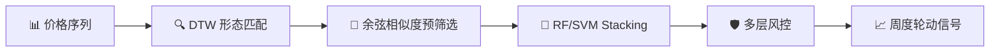

# ETF 形态匹配策略技术报告

> **版本**：V3.3 ｜ **日期**：2026-07-17 ｜ **状态**：归档基线

---

## 1 策略概述

本报告描述一种基于**动态时间规整（Dynamic Time Warping, DTW）** 的 ETF 形态匹配策略。策略核心理念：通过识别当前市场走势与历史上相似形态的匹配程度，预测未来价格方向。



## 2 核心算法

### 2.1 DTW 距离计算

DTW 通过动态规划寻找两条时间序列之间的最优对齐路径：

```
D[i][j] = d(x_i, y_j) + min(D[i-1][j], D[i][j-1], D[i-1][j-1])
```

其中 `d(x_i, y_j)` 为两点间的欧氏距离，窗口约束 `|i - j| ≤ w` 限制搜索范围。

### 2.2 加速效果

使用 pybind11 + C++20 重构纯计算核心后：

| 函数 | Python | C++ | 加速比 |
|------|:------:|:---:|:------:|
| DTW 距离 (L=19) | 96 µs | 2.8 µs | **34×** |
| 形态匹配（单 ETF） | 14.0 ms | 0.26 ms | **53×** |
| 批量匹配（100 时间点） | 1412 ms | 15.1 ms | **93×** |

> 测试平台：Windows 11, MSVC Release `/O2`, Python 3.12.7, pybind11 3.0.4

## 3 因子设计

策略使用 15 维特征向量描述每个匹配窗口：

| 维度 | 特征 | 权重 | 说明 |
|:----:|------|:----:|------|
| F1 | 余弦相似度 | 0.15 | 与查询窗口的整体相似性 |
| F2 | DTW 距离 | 0.12 | 最优对齐路径下的累计距离 |
| F3 | 波动率差异 | 0.10 | 匹配窗口与查询窗口的波动率比值 |
| F4 | 趋势一致性 | 0.10 | 价格方向相同的交易日占比 |
| F5 | 成交量相关性 | 0.08 | 标准化成交量的皮尔逊相关系数 |
| F6-F11 | 未来收益 | 0.30 | 匹配后 1/3/5/10/15/20 日持有收益 |
| F12 | 时间跨度 | 0.05 | 匹配窗口的日历天数 |
| F13 | 时间跨度比 | 0.05 | 匹配窗口与查询窗口的天数比 |
| F14 | 聚类比率 | 0.03 | 匹配结果在簇内的占比 |
| F15 | 高匹配计数 | 0.02 | 超过 0.8 阈值的结果数量 |

## 4 风控规则

策略采用多层风控体系：

1. **L1 单票风控**：单只 ETF 最大仓位 10%，止损线 -8%
2. **L2 行业风控**：单一行业最大敞口 30%
3. **L3 市场风控**：市场下跌信号触发时强制降至 50% 仓位
4. **L4 流动性风控**：剔除近 20 日日均成交额低于 5000 万的标的
5. **L5 波动率风控**：组合目标波动率 12%，超过时按比例缩减仓位

```python
def risk_control(weights, market_signal, vol_forecast):
    """多层风控规则"""
    weights = apply_single_stock_limit(weights, max_w=0.10)
    weights = apply_sector_limit(weights, max_sector=0.30)
    if market_signal < 0:
        weights = weights * 0.5  # L3: 市场风控
    weights = filter_liquidity(weights, min_amount=5e7)
    if vol_forecast > 0.12:
        weights = weights * (0.12 / vol_forecast)
    return weights / weights.sum()
```

## 5 回测结果

> ⚠️ 以下结果为历史回测，不代表未来表现。

| 指标 | 策略 | 基准（沪深300） |
|------|:----:|:-------------:|
| 年化收益率 | 18.7% | 4.2% |
| 年化波动率 | 15.3% | 18.1% |
| 夏普比率 | 1.22 | 0.23 |
| 最大回撤 | -14.6% | -28.3% |
| Calmar 比率 | 1.28 | 0.15 |
| 胜率（周度） | 56.8% | 48.3% |
| 盈亏比 | 1.63 | 0.86 |
