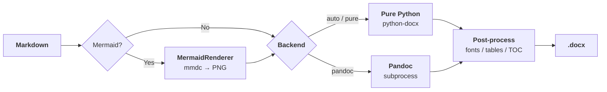

# DOCX Pipeline

[](https://github.com/redamancy231-create/docx-pipeline/actions/workflows/ci.yml)
[](https://pypi.org/project/docx-pipeline/)
[]()
[]()

[中文](../README.md) · [正體中文](../zh-Hant/README.md)

A command-line tool that converts Markdown documents into high-quality DOCX files. It supports dual backends—native generation with python-docx and conversion with pandoc—includes built-in Mermaid diagram rendering, and provides four preset templates for Chinese-language documents.



## Table of Contents

- [Overview](#overview)
- [Installation](#installation)
- [Quick Start](#quick-start)
- [Command Reference](#command-reference)
- [Configuration Reference](#configuration-reference)
- [Template Reference](#template-reference)
- [Examples](#examples)
- [Notes](#notes)
- [Related Projects | 相关项目](#related-projects--相关项目)
- [Project Structure](#project-structure)

## Overview

DOCX Pipeline solves the common problem of unpredictable Chinese typography when converting Markdown to Word. Its dual-backend architecture gives you:

- **python-docx backend**: Fine-grained control over Chinese typesetting elements such as fonts, font sizes, line spacing, first-line indentation, and table styles
- **pandoc backend**: pandoc's mature Markdown parsing and syntax highlighting, ideal for complex technical documents
- **Mermaid integration**: Automatic detection of Mermaid code blocks, which are rendered as images and embedded in the document
- **Template system**: Four preset templates covering general documents, academic papers, technical reports, and quantitative strategy documents

## Installation

### Dependencies

| Component | Required | Description |
|-----------|----------|-------------|
| Python 3.10+ | Yes | Runtime environment |
| pandoc | No | Optional backend; required when `pandoc.enabled=true` |
| mermaid-cli (@mermaid-js/mermaid-cli) | No | Mermaid diagram rendering; required when `mermaid.enabled=true` |

### Installation Steps

```bash
# 1. Install docx-pipeline (auto-installs python-docx, PyYAML, click, Pillow)
pip install git+https://github.com/redamancy231-create/docx-pipeline.git

# 2. (Optional) Install pandoc
# Windows: choco install pandoc  or download from https://pandoc.org
# macOS: brew install pandoc
# Linux: sudo apt install pandoc

# 3. (Optional) Install mermaid-cli
npm install -g @mermaid-js/mermaid-cli
```

## Quick Start

### Initialize the Project Configuration

```bash
# Create a config file in the current directory using the default template
docx-pipeline init --project-dir ./my-project

# Specify a template type
docx-pipeline init --project-dir ./my-project --template academic

# Set the project name
docx-pipeline init --project-dir ./my-project --template report --name "Technical Report"
```

### Convert Markdown to DOCX

```bash
# Convert using project.yaml in the current directory
docx-pipeline convert --config ./project.yaml

# Specify an output file
docx-pipeline convert --config ./project.yaml --output ./output/report.docx

# Use the pandoc backend
docx-pipeline convert --config ./project.yaml --method pandoc

# Dry-run mode (print planned operations without generating a file)
docx-pipeline convert --config ./project.yaml --dry-run
```

## Backend Comparison

| Feature | Pure Python | Pandoc |
|---------|:-----------:|:------:|
| Headings (h1-h6) | ✅ | ✅ |
| Tables | ✅ | ✅ |
| Code blocks (with highlighting) | ✅ (no syntax highlight) | ✅ (with syntax highlight) |
| Inline code | ✅ | ✅ |
| Bold / Italic | ✅ | ✅ |
| Blockquotes | ✅ | ✅ |
| Images | ✅ (embedded) | ✅ (embedded) |
| Lists (ordered/unordered) | ✅ | ✅ |
| Horizontal rules | ✅ | ✅ |
| YAML frontmatter | ✅ (skipped) | ✅ (skipped) |
| Mermaid diagrams | ✅ (pre-rendered PNG) | ✅ (pre-rendered PNG) |
| Table of Contents | ✅ (field code) | ✅ (`--toc` flag) |
| Chinese typography post-processing | ✅ | ❌ (requires a reference DOCX) |
| External dependencies | None (standard); Node.js + mermaid-cli (Mermaid) | pandoc |
| Output file size | Typically smaller | Typically larger (embeds resources) |

## When to Use Which Backend

- **Pure Python**: Ideal for documents requiring precise Chinese typography control, when you want to avoid external dependencies, or prefer smaller output files.
- **Pandoc**: Best for technical documents needing code syntax highlighting, when you need `--number-sections` or `--toc` Pandoc features, and already have pandoc installed.
- **Auto (default)**: Uses Pure Python by default; only switches to Pandoc when `pandoc.enabled=true` in config AND pandoc is installed on the system.

## Known Limitations

- The Pure Python backend does not provide syntax highlighting for code blocks.
- Mermaid rendering requires Node.js and mermaid-cli; these are not bundled with docx-pipeline.
- Chinese typography features (fonts, indentation, heading colors) are designed for CJK documents; English or other Latin-script documents should use Pandoc directly or other tools.

## Planned Improvements

The following features are on the roadmap. Feedback via Issues/Discussions is welcome to help prioritize:

- **Batch conversion**: Convert an entire directory of Markdown files to corresponding DOCX files, useful for multi-chapter documents or batch report generation
- **Example gallery**: Reproducible input Markdown + output DOCX screenshots for each template, so you can quickly see the visual results
- **Installation troubleshooting guide**: Cover common setup issues on Windows/macOS/Linux, Chinese font configuration, and optional dependency diagnostics

> 💡 These features are not yet scheduled. If you particularly need one, please open a GitHub Issue — user feedback accelerates prioritization.

## Command Reference

### `init` — Initialize the Project Configuration

```bash
docx-pipeline init [options]
```

| Option | Description | Default |
|--------|-------------|---------|
| `--project-dir` | Project root directory (required) | — |
| `--template`, `-t` | Template type: `default`, `academic`, `report`, or `strategy` | `default` |
| `--name`, `-n` | Project name | Directory name |
| `--md-file` | Path to the entry Markdown file | — |
| `--force` | Overwrite an existing project.yaml | `false` |

Generated file:
- `project.yaml` — Project configuration file

### `convert` — Run a Conversion

```bash
docx-pipeline convert [options]
```

| Option | Description | Default |
|--------|-------------|---------|
| `--config`, `-c` | Path to the configuration file (required) | — |
| `--method` | Conversion engine: `pure`, `pandoc`, or `auto` | `auto` |
| `--output`, `-o` | Output .docx path | `paths.docx_output` from the config file |
| `--dry-run` | Print planned operations without generating a file | `false` |
| `--verbose`, `-v` | Enable verbose output | `false` |
| `--pandoc-args` | Additional arguments to pass to pandoc | — |

### `validate` — Validate a Configuration File

```bash
docx-pipeline validate --config ./project.yaml
```

Validates the configuration against JSON Schema. Also checks whether `md_source` exists, whether the output directory is writable, whether font sizes are within the allowed range, and whether external dependencies are available.

### `info` — View a Configuration Summary

```bash
docx-pipeline info --config ./project.yaml
```

Prints a configuration summary including the project name, paths, fonts, page settings, and Pandoc/Mermaid status.

## Configuration Reference

The configuration file uses YAML and contains the following top-level fields:

### `project` (required)

Project metadata.

```yaml
project:
  name: "Project Name"     # Required; 1-128 characters
  root: "."                # Project root directory (base for path resolution)
```

### `paths` (required)

Path configuration. Relative paths are resolved against `project.root`.

```yaml
paths:
  md_source: "./md/main.md"      # Markdown source file path; required
  docx_output: "./output/doc.docx"  # DOCX output path; required
  json_source: "./output"        # JSON metadata directory
  work_dir: "./work"             # Working directory for intermediate files
  reference_docx: ""            # pandoc reference document
```

### `fonts`

Font configuration. `east_asian` controls Chinese characters, while `latin` controls Latin text and numbers.

```yaml
fonts:
  east_asian: "Microsoft YaHei"
  latin: "Microsoft YaHei"
  symbol: ""
```

### `font_sizes`

Font size configuration in points (pt). `headings` is a mapping for h1 through h6.

```yaml
font_sizes:
  body: 10.5
  table: 9.0
  code: 8.5
  headings:
    h1: 22.0
    h2: 16.0
    h3: 14.0
```

### `font_colors`

Font colors. Supports hexadecimal color values or `"auto"`, which uses Word's default color.

```yaml
font_colors:
  body: "auto"
  heading: "auto"
  link: "#0563C1"
  code: "auto"
  code_block_bg: "#F5F5F5"
  blockquote: "#555555"
  horizontal_rule: "#CCCCCC"
```

### `page`

Page settings. `margins` are measured in **cm**.

```yaml
page:
  size: "A4"              # A4 | Letter | A3 | B5
  orientation: "portrait" # portrait | landscape
  margins:
    top: 2.54
    bottom: 2.54
    left: 3.18
    right: 3.18
```

### `pandoc`

Pandoc conversion options.

```yaml
pandoc:
  enabled: false          # Whether to enable the pandoc backend
  extra_args: []          # Additional pandoc command-line arguments
  reference_docx: ""      # Path for --reference-doc
```

### `mermaid`

Mermaid diagram rendering configuration.

```yaml
mermaid:
  enabled: false          # Whether to enable Mermaid rendering
  image:
    format: "png"         # Output format: png | svg
    dpi: 300              # Rendering DPI
    scale: 1.0            # Scale factor
  render:
    mmdc_path: "mmdc"     # Path to mermaid-cli
    puppeteer_config: ""  # Path to the Puppeteer configuration
    timeout: 60           # Timeout in seconds
```

### `version`

Document version metadata.

```yaml
version:
  number: "1.0.0"
  label: ""               # Version label (e.g., "Draft")
  date: ""                # Version date
```

### `styles`

Paragraph, table, table of contents (TOC), and heading styles.

```yaml
styles:
  toc:
    enabled: true
    depth: 3
    title: "目录"
  table:
    style: "Table Grid"
    autofit: true
    header_bold: true
    header_shading: "#D9E2F3"
  paragraph:
    line_spacing: 1.15
    space_after: 6.0       # Space after the paragraph (pt)
    first_line_indent: 0.0 # First-line indent (cm)
  heading:
    levels: {}             # Per-level overrides for h1-h6
```

### `backup`

Backup settings.

```yaml
backup:
  enabled: true
  max_backups: 5           # Maximum number of backups to retain
  suffix: ".bak"
```

## Template Reference

Four built-in templates are available in the `docx_pipeline/data/templates/` directory.

### 1. default — General Chinese Documents

| Property | Value |
|----------|-------|
| File | `templates/default.yaml` |
| Best for | General Chinese documents, memos, and internal documentation |
| Font | Microsoft YaHei (for both Latin and East Asian text) |
| Body font size | 10.5pt |
| Line spacing | 1.15× |
| First-line indent | None |
| Pandoc | Disabled |
| Mermaid | Disabled |

### 2. academic — Academic Papers

| Property | Value |
|----------|-------|
| File | `templates/academic.yaml` |
| Best for | Academic papers, theses and dissertations, and journal submissions |
| Font | SimSun (body) + SimHei (headings); Times New Roman for Latin text |
| Body font size | 12pt |
| Line spacing | 1.25× |
| First-line indent | Yes (2-character width) |
| Pandoc | Disabled |
| Mermaid | Disabled |

### 3. report — Technical Reports

| Property | Value |
|----------|-------|
| File | `templates/report.yaml` |
| Best for | Technical reports, project documentation, and analytical reports with Mermaid diagrams |
| Font | Microsoft YaHei (for both Latin and East Asian text) |
| Body font size | 10.5pt |
| Line spacing | 1.15× |
| First-line indent | None |
| Pandoc | **Enabled** (with `--embed-resources`, `--toc`, and `--number-sections`) |
| Mermaid | **Enabled** |
| TOC | Auto-generated |
| Table | TableGrid |

### 4. strategy — Quantitative Strategies

| Property | Value |
|----------|-------|
| File | `templates/strategy.yaml` |
| Best for | Quantitative strategy documents, factor research reports, and backtest analysis reports |
| Font | DengXian (sans-serif, for both Latin and East Asian text) |
| Body font size | 10.5pt |
| Line spacing | 1.15× |
| First-line indent | None |
| Pandoc | Disabled |
| Mermaid | Disabled |

### Template Selection Guide

```
Need auto TOC and section numbering? → report
Academic paper layout (indent + SimSun)? → academic
Data-intensive / quantitative documents? → strategy
Other general Chinese documents? → default
```

## Examples

### Example 1: Convert Project Documentation

```bash
cd ~/my-project

# Initialize with the technical report template
docx-pipeline init --project-dir . --template report --name "Project Docs"

# Edit project.yaml to set input/output paths
# paths:
#   md_source: "./chapters/main.md"
#   docx_output: "./output/report.docx"

# Run the conversion
docx-pipeline convert --config ./project.yaml

# Output: output/report.docx with TOC and rendered Mermaid diagrams
```

### Example 2: Convert an Academic Paper

```bash
cd ~/thesis

# Initialize with the academic template
docx-pipeline init --project-dir . --template academic --name "Master's Thesis"

# Generate the paper
docx-pipeline convert --config ./project.yaml
```

### Example 3: Quickly Convert a Single File

```bash
# Convert a single Markdown file directly
docx-pipeline convert \
  --config ./project.yaml \
  --output ./meeting-notes.docx
```

## Notes

### Windows Encoding

When running under Windows Git Bash or PowerShell, the tool automatically configures UTF-8 encoding. If you encounter garbled text, set it manually:

```bash
export PYTHONIOENCODING=utf-8
```

Or in PowerShell:

```powershell
$env:PYTHONIOENCODING = "utf-8"
```

### Path Format

Use forward slashes `/` for all paths in the configuration file to ensure cross-platform compatibility. Relative paths are resolved against `project.root`; absolute paths are used as-is.

```yaml
paths:
  md_source: "./chapters/main.md"        # Relative path (recommended)
  docx_output: "./output/report.docx"
```

### Font Availability

Fonts specified in the configuration file must be installed in the runtime environment. Otherwise, Word will substitute a default font when the document is opened.

Quick reference for font availability on Windows:

| Font name | YAML value | Preinstalled on Windows 10/11 |
|-----------|------------|-------------------------------|
| Microsoft YaHei | `Microsoft YaHei` | Yes |
| SimSun | `SimSun` | Yes |
| SimHei | `SimHei` | Yes |
| DengXian | `DengXian` | Yes (Office 2013+) |
| Times New Roman | `Times New Roman` | Yes |
| Consolas | `Consolas` | Yes |

### Pandoc Dependency

When `pandoc.enabled: true`, pandoc must be installed on the system and accessible through `PATH`. Verify the installation with:

```bash
pandoc --version
```

pandoc is not a required default backend—only the `report` template enables it by default. If pandoc is unavailable but you still need to convert a document containing Mermaid diagrams, use the `default` template, render the Mermaid diagrams to images manually, and embed them in the Markdown.

> **Security note**: Arguments in `pandoc.extra_args` and `--pandoc-args` are passed directly to pandoc. Pandoc options such as `--filter` and `--lua-filter` can execute external programs, so **make sure that `project.yaml` comes from a trusted source**. User-supplied `--pandoc-args` values are treated as an explicit advanced use case and are used at the user's own risk.

### Mermaid Diagram Rendering

When `mermaid.enabled: true`, you must:

1. Install Node.js (≥16)
2. Install mermaid-cli globally: `npm install -g @mermaid-js/mermaid-cli`
3. Make sure the `mmdc` command is accessible through `PATH`

Rendered images use PNG format and 300 DPI by default. If a Mermaid code block fails to render, the original code is retained in the DOCX with a warning note. Extremely tall diagrams are automatically split into multiple horizontal slices to prevent blank pages.

### Mermaid Handling in the python-docx Backend

When `pandoc.enabled: false` and `mermaid.enabled: true`, Mermaid diagrams are first rendered as PNG images and then embedded through python-docx. When `pandoc.enabled: true`, pandoc handles embedding the rendered images.

### Fine-Tuning Styles

If you need finer-grained style control than the YAML configuration provides—for example, custom paragraph spacing or special table borders—we recommend that you:

1. Generate an initial DOCX with a template
2. Adjust its styles manually in Word
3. Save the adjusted DOCX as the `reference_docx`
4. Set `pandoc.reference_docx` in the configuration to point to that file

## Related Projects | 相关项目

<details>
<summary>My other open-source repositories</summary>

| Repository | Description |
|------------|-------------|
| [ai-collaboration-framework](https://github.com/redamancy231-create/ai-collaboration-framework) | Full-lifecycle human-AI collaboration methodology framework |
| [independent-review-toolkit](https://github.com/redamancy231-create/independent-review-toolkit) | Multi-model independent review SOPs and cross-validation tools |
| [prompt-tdd-methodology](https://github.com/redamancy231-create/prompt-tdd-methodology) | Controlled prompt-engineering experiment casebook |
| [etf-pattern-match-pybind11](https://github.com/redamancy231-create/etf-pattern-match-pybind11) | C++20/pybind11 ETF pattern-matching core (DTW 37× speedup) |
| [claude-skills](https://github.com/redamancy231-create/claude-skills) | Claude Code Skills: session handoff, CLAUDE.md generator, pre-registration audit |
| [ma-case-study-pipeline](https://github.com/redamancy231-create/ma-case-study-pipeline) | 8-stage multi-model academic pipeline with cross-blind review |

</details>

## Project Structure

```
docx-pipeline/
├── LICENSE                                     # MIT License
├── README.md                                   # This document (Chinese)
├── en/
│   └── README.md                               # English README
├── zh-Hant/
│   └── README.md                               # Traditional Chinese README
├── pyproject.toml                              # Packaging configuration
├── project_status.md                           # Project status
├── reference_files.md                          # File index
├── tests/
│   ├── test_basic.py                           # Basic tests (config/parser/CLI/backup)
│   └── fixtures/                               # Test fixtures
└── docx_pipeline/
    ├── __init__.py                             # Package index
    ├── cli.py                                  # Click CLI (init/convert/validate/info)
    ├── config/
    │   ├── __init__.py
    │   ├── defaults.py                         # 4 preset templates
    │   ├── loader.py                           # YAML loading + env var overrides
    │   ├── schema.py                           # Configuration dataclass definitions
    │   └── validator.py                        # Configuration validation + dependency probing
    ├── converters/
    │   ├── __init__.py                         # Exports Abstract/Pure/Pandoc
    │   ├── base.py                             # AbstractConverter (with backup rotation)
    │   ├── markdown_parser.py                  # Line-by-line state-machine MD parser
    │   ├── pure_python.py                      # Pure Python converter (with Mermaid + images)
    │   ├── pandoc_converter.py                 # Pandoc converter
    │   └── shared.py                           # Shared constants and helpers
    ├── data/
    │   ├── schemas/
    │   │   └── project_config.schema.json      # JSON Schema (Draft-07)
    │   └── templates/
    │       ├── default.yaml                    # General Chinese document template
    │       ├── academic.yaml                   # Academic paper template
    │       ├── report.yaml                     # Technical report template
    │       └── strategy.yaml                   # Quantitative strategy template
    ├── renderers/
    │   ├── __init__.py                         # Exports MermaidRenderer
    │   └── mermaid_renderer.py                 # Mermaid pre-renderer
    └── utils/
        ├── __init__.py
        ├── encoding.py                         # Windows UTF-8 environment setup
        └── paths.py                            # Path normalization
```
