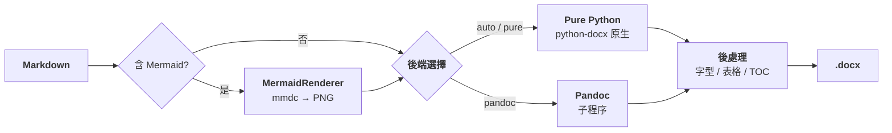

# DOCX Pipeline

[](../README.md)
[](../en/README.md)

> **English Abstract**: DOCX Pipeline converts Markdown to production-quality Chinese DOCX files. It offers a dual backend (Pure Python via python-docx + Pandoc subprocess), automatic Mermaid diagram rendering, and 4 preset templates covering general documents, academic papers, technical reports, and quantitative strategy documents. Fonts, sizes, margins, line spacing, and table styles are fully configurable via YAML. Tested across 3 rounds of independent LLM review with 17 automated tests passing.



將 Markdown 文件轉換為高品質 DOCX 檔案的命令列工具。提供 python-docx 原生後端與 pandoc 後端，內建 Mermaid 圖表渲染，提供 4 套預設中文範本。

## 目錄

- [簡介](#簡介)
- [安裝](#安裝)
- [快速開始](#快速開始)
- [指令參考](#指令參考)
- [設定說明](#設定說明)
- [範本說明](#範本說明)
- [範例](#範例)
- [注意事項](#注意事項)
- [專案結構](#專案結構)

## 簡介

DOCX Pipeline 解決 Markdown 轉 Word 文件時中文排版失控的痛點。雙後端架構讓你可以：

- **python-docx 後端**：精細控制字型、字型大小、行距、首行縮排、表格樣式等中文排版要素
- **pandoc 後端**：利用 pandoc 成熟的 Markdown 解析和程式碼語法突顯能力，適合複雜技術文件
- **Mermaid 整合**：自動偵測 Mermaid 程式碼區塊，渲染為圖片後嵌入
- **範本系統**：4 套預設範本涵蓋通用文件、學術論文、技術報告、量化策略情境

## 安裝

### 依賴

| 元件 | 必要 | 說明 |
|------|------|------|
| Python 3.10+ | 是 | 執行環境 |
| pandoc | 否 | 選用後端，`pandoc.enabled=true` 時需要 |
| mermaid-cli (@mermaid-js/mermaid-cli) | 否 | Mermaid 圖表渲染，`mermaid.enabled=true` 時需要 |

### 安裝步驟

```bash
# 1. 安裝 docx-pipeline（自動安裝 python-docx、PyYAML、click、Pillow）
pip install docx-pipeline

# 2. (可選) 安裝 pandoc
# Windows: choco install pandoc  或從 https://pandoc.org/ 下載安裝
# macOS: brew install pandoc
# Linux: sudo apt install pandoc

# 3. (可選) 安裝 mermaid-cli
npm install -g @mermaid-js/mermaid-cli
```

## 快速開始

### 初始化專案設定

```bash
# 使用預設範本在當前目錄建立設定檔
docx-pipeline init --project-dir ./my-project

# 指定範本類型
docx-pipeline init --project-dir ./my-project --template academic

# 指定專案名稱
docx-pipeline init --project-dir ./my-project --template report --name "技術報告"
```

### 轉換 Markdown 為 DOCX

```bash
# 使用當前目錄的 project.yaml 轉換
docx-pipeline convert --config ./project.yaml

# 指定輸出檔案
docx-pipeline convert --config ./project.yaml --output ./output/report.docx

# 使用 pandoc 後端
docx-pipeline convert --config ./project.yaml --method pandoc

# 預覽模式（不實際生成檔案）
docx-pipeline convert --config ./project.yaml --dry-run
```

## 指令參考

### `init` —— 初始化專案設定

```bash
docx-pipeline init [選項]
```

| 選項 | 說明 | 預設值 |
|------|------|--------|
| `--project-dir` | 專案根目錄（必要） | — |
| `--template`, `-t` | 範本類型：`default`, `academic`, `report`, `strategy` | `default` |
| `--name`, `-n` | 專案名稱 | 目錄名稱 |
| `--md-file` | 入口 Markdown 檔案路徑 | — |
| `--force` | 覆寫已存在的 project.yaml | `false` |

產生檔案：
- `project.yaml` — 專案設定檔

### `convert` —— 執行轉換

```bash
docx-pipeline convert [選項]
```

| 選項 | 說明 | 預設值 |
|------|------|--------|
| `--config`, `-c` | 設定檔路徑（必要） | — |
| `--method` | 轉換引擎：`pure`, `pandoc`, `auto` | `auto` |
| `--output`, `-o` | 輸出 .docx 路徑 | 設定檔中的 `paths.docx_output` |
| `--dry-run` | 僅列印操作，不產生檔案 | `false` |
| `--verbose`, `-v` | 詳細輸出 | `false` |
| `--pandoc-args` | 傳遞給 pandoc 的額外參數 | — |

### `validate` —— 驗證設定檔

```bash
docx-pipeline validate --config ./project.yaml
```

對照 `schemas/project_config.schema.json` 進行 JSON Schema 驗證，檢查 md_source 是否存在、輸出目錄是否可寫、字型大小範圍、外部依賴可用性等。

### `info` —— 檢視設定摘要

```bash
docx-pipeline info --config ./project.yaml
```

列印專案名稱、路徑、字型、頁面設定、Pandoc/Mermaid 狀態等設定摘要。

## 設定說明

設定檔為 YAML 格式，包含以下最上層欄位：

### `project` （必填）

專案中繼資訊。

```yaml
project:
  name: "專案名稱"         # 必填，1-128字元
  root: "."                # 專案根目錄（路徑解析基準）
```

### `paths` （必填）

路徑設定。相對路徑會以 `project.root` 為基準解析。

```yaml
paths:
  md_source: "./md/main.md"      # Markdown原始檔路徑，必填
  docx_output: "./output/doc.docx"  # DOCX輸出路徑，必填
  json_source: "./output"        # JSON後設資料目錄
  work_dir: "./work"             # 中間檔案工作目錄
  reference_docx: ""            # pandoc參考文件
```

### `fonts`

字型設定。`east_asian` 控制中文字元，`latin` 控制英文/數字。

```yaml
fonts:
  east_asian: "微軟雅黑"
  latin: "微軟雅黑"
  symbol: ""
```

### `font_sizes`

字型大小設定（pt）。`headings` 為 h1-h6 的對應字典。

```yaml
font_sizes:
  body: 10.5
  table: 9.0
  code: 8.5
  headings:
    h1: 22.0
    h2: 16.0
    h3: 14.0
```

### `font_colors`

字型顏色。支援 hex 顏色值或 `"auto"`（使用 Word 預設色彩）。

```yaml
font_colors:
  body: "auto"
  heading: "auto"
  link: "#0563C1"
  code: "auto"
  code_block_bg: "#F5F5F5"
  blockquote: "#555555"
  horizontal_rule: "#CCCCCC"
```

### `page`

頁面設定。`margins` 單位為 **cm**。

```yaml
page:
  size: "A4"              # A4 | Letter | A3 | B5
  orientation: "portrait" # portrait | landscape
  margins:
    top: 2.54
    bottom: 2.54
    left: 3.18
    right: 3.18
```

### `pandoc`

Pandoc 轉換選項。

```yaml
pandoc:
  enabled: false          # 是否啟用pandoc後端
  extra_args: []          # 額外pandoc命令列引數
  reference_docx: ""      # --reference-doc 路徑
```

### `mermaid`

Mermaid 圖表渲染設定。

```yaml
mermaid:
  enabled: false          # 是否啟用Mermaid渲染
  image:
    format: "png"         # 輸出格式：png | svg
    dpi: 300              # 渲染DPI
    scale: 1.0            # 縮放倍數
  render:
    mmdc_path: "mmdc"     # mermaid-cli路徑
    puppeteer_config: ""  # Puppeteer配置路徑
    timeout: 60           # 超時秒數
```

### `version`

文件版本中繼資料。

```yaml
version:
  number: "1.0.0"
  label: ""               # 版本標籤（如"草稿"）
  date: ""                # 版本日期
```

### `styles`

段落、表格、目錄、標題樣式。

```yaml
styles:
  toc:
    enabled: true
    depth: 3
    title: "目錄"
  table:
    style: "Table Grid"
    autofit: true
    header_bold: true
    header_shading: "#D9E2F3"
  paragraph:
    line_spacing: 1.15
    space_after: 6.0       # 段後間距（pt）
    first_line_indent: 0.0 # 首行縮排（cm）
  heading:
    levels: {}             # h1-h6 逐級覆蓋
```

### `backup`

備份設定。

```yaml
backup:
  enabled: true
  max_backups: 5           # 最大保留份數
  suffix: ".bak"
```

## 範本說明

內建 4 套範本，位於 `templates/` 目錄。

### 1. default —— 通用中文文件

| 屬性 | 值 |
|------|-----|
| 檔案 | `templates/default.yaml` |
| 適用情境 | 通用中文文件、備忘錄、內部文件 |
| 字型 | 微軟雅黑（西文+東亞統一） |
| 內文字型大小 | 10.5pt（五號） |
| 行距 | 1.15 倍 |
| 首行縮排 | 無 |
| Pandoc | 停用 |
| Mermaid | 停用 |

### 2. academic —— 學術論文

| 屬性 | 值 |
|------|-----|
| 檔案 | `templates/academic.yaml` |
| 適用情境 | 學術論文、畢業論文、期刊投稿 |
| 字型 | 宋體（內文）+ 黑體（標題），西文 Times New Roman |
| 內文字型大小 | 12pt（小四號） |
| 行距 | 1.25 倍 |
| 首行縮排 | 有（2字元） |
| Pandoc | 停用 |
| Mermaid | 停用 |

### 3. report —— 技術報告

| 屬性 | 值 |
|------|-----|
| 檔案 | `templates/report.yaml` |
| 適用情境 | 技術報告、專案文件、分析報告（含 Mermaid 圖表） |
| 字型 | 微軟雅黑（西文+東亞統一） |
| 內文字型大小 | 10.5pt（五號） |
| 行距 | 1.15 倍 |
| 首行縮排 | 無 |
| Pandoc | **啟用**（含 `--embed-resources`、`--toc`、`--number-sections`） |
| Mermaid | **啟用** |
| 目錄 | 自動產生 |
| 表格 | TableGrid |

### 4. strategy —— 量化策略

| 屬性 | 值 |
|------|-----|
| 檔案 | `templates/strategy.yaml` |
| 適用情境 | 量化策略文件、因子研究報告、回測分析報告 |
| 字型 | 等線/DengXian（無襯線，西文+東亞統一） |
| 內文字型大小 | 10.5pt（五號） |
| 行距 | 1.15 倍 |
| 首行縮排 | 無 |
| Pandoc | 停用 |
| Mermaid | 停用 |

### 範本選擇指南

```
需要自動目錄和章節編號？ → report
學術論文排版（縮排+宋體）？ → academic
量化/資料密集型文件？ → strategy
其他一般中文文件？ → default
```

## 範例

### 範例 1：轉換專案文件

```bash
# 進入專案目錄
cd ~/my-project

# 初始化技術報告設定
docx-pipeline init --project-dir . --template report --name "專案文件"

# 編輯 project.yaml 設定輸入輸出路徑
# paths:
#   md_source: "./chapters/main.md"
#   docx_output: "./output/report.docx"

# 執行轉換
docx-pipeline convert --config ./project.yaml

# 輸出：output/report.docx，含目錄和渲染後的 Mermaid 圖表
```

### 範例 2：轉換學術論文

```bash
cd ~/thesis

# 初始化學術論文設定
docx-pipeline init --project-dir . --template academic --name "碩士論文"

# 生成論文
docx-pipeline convert --config ./project.yaml
```

### 範例 3：單檔案快速轉換

```bash
# 直接轉換單個 Markdown 檔案
docx-pipeline convert \
  --config ./project.yaml \
  --output ./meeting-notes.docx
```

## 注意事項

### Windows 編碼

在 Windows Git Bash 或 PowerShell 中執行時，工具會自動設定 UTF-8 編碼。如果遇到亂碼，手動設定：

```bash
export PYTHONIOENCODING=utf-8
```

或在 PowerShell 中：

```powershell
$env:PYTHONIOENCODING = "utf-8"
```

### 路徑格式

設定檔中的所有路徑使用正斜線 `/`（跨平台相容）。相對路徑會以 `project.root` 為基準解析，絕對路徑則直接使用。

```yaml
paths:
  md_source: "./chapters/main.md"        # 相對路徑（推薦）
  docx_output: "./output/report.docx"
```

### 字型可用性

設定檔中指定的字型必須在執行環境中已安裝，否則 Word 開啟時會改用預設字型。

Windows 字型可用性速查：

| 字型名稱 | YAML 值 | Windows 10/11 預裝 |
|--------|---------|-------------------|
| 微軟雅黑 | `Microsoft YaHei` | 是 |
| 宋體 | `SimSun` | 是 |
| 黑體 | `SimHei` | 是 |
| 等線 | `DengXian` | 是（Office 2013+） |
| Times New Roman | `Times New Roman` | 是 |
| Consolas | `Consolas` | 是 |

### Pandoc 依賴

`pandoc.enabled: true` 時需要系統中已安裝 pandoc 且可透過 PATH 執行。驗證安裝：

```bash
pandoc --version
```

pandoc 並非必要依賴，也不是預設後端——僅 `report` 範本預設啟用。如果 pandoc 不可用但仍需轉換含 Mermaid 的文件，可使用 `default` 範本並手動將 Mermaid 渲染為圖片後嵌入 Markdown。

> **安全提示**：`pandoc.extra_args` 和 `--pandoc-args` 中的參數直接傳給 pandoc。Pandoc 的 `--filter`/`--lua-filter` 等參數可以執行外部程式，因此 **請確保 `project.yaml` 來自可信來源**。CLI 使用者主動傳入的 `--pandoc-args` 視為顯式高階用法，由使用者自行承擔風險。

### Mermaid 圖表渲染

`mermaid.enabled: true` 時需要：

1. 安裝 Node.js（≥16）
2. 全域安裝 mermaid-cli：`npm install -g @mermaid-js/mermaid-cli`
3. 確保 `mmdc` 指令可透過 PATH 執行

渲染圖片預設使用 PNG 格式，300 DPI 輸出。渲染失敗的 Mermaid 程式碼區塊會在 DOCX 中保留原始程式碼並加入警告註解。高度過高的圖表會自動水平分割為多張圖片，避免單頁空白。

### python-docx 後端的 Mermaid 處理

當 `pandoc.enabled: false` 且 `mermaid.enabled: true` 時，Mermaid 先渲染為 PNG，再透過 python-docx 嵌入文件。當 `pandoc.enabled: true` 時，渲染後的圖片由 pandoc 處理嵌入。

### 樣式微調

如果需要超出 YAML 設定範圍的精細樣式控制（如自訂段落間距、特殊表格框線），建議：

1. 先用範本產生初版 DOCX
2. 在 Word 中手動調整樣式
3. 儲存調整後的 DOCX 作為 `reference_docx`
4. 在設定中將 `pandoc.reference_docx` 指向該檔案

## 相關專案 | Related Projects

<details>
<summary>我的其他開源儲存庫 | My other open-source repos</summary>

| 儲存庫 | 說明 |
|------|------|
| [ai-collaboration-framework](https://github.com/redamancy231-create/ai-collaboration-framework) | 人類-AI協作全生命週期方法論框架 |
| [independent-review-toolkit](https://github.com/redamancy231-create/independent-review-toolkit) | 獨立審查SOP與多模型交叉驗證工具 |
| [prompt-tdd-methodology](https://github.com/redamancy231-create/prompt-tdd-methodology) | Prompt對照實驗方法論案例手冊 |
| [etf-pattern-match-pybind11](https://github.com/redamancy231-create/etf-pattern-match-pybind11) | C++20/pybind11加速型態比對ETF策略（DTW 37×） |
| [claude-skills](https://github.com/redamancy231-create/claude-skills) | Claude Code Skills：會話交接、CLAUDE.md 產生、預註冊稽核 |
| [ma-case-study-pipeline](https://github.com/redamancy231-create/ma-case-study-pipeline) | 多模型協同學術管線——8階段+開卷/盲答對照 |

</details>

## 專案結構

```
docx-pipeline/
├── LICENSE                                     # MIT 許可證
├── README.md                                   # 中文 README
├── en/
│   └── README.md                               # English README
├── zh-Hant/
│   └── README.md                               # 正體中文 README
├── pyproject.toml                              # 打包設定
├── project_status.md                           # 專案狀態
├── reference_files.md                          # 檔案索引
├── tests/
│   ├── test_basic.py                           # 基礎測試（配置/解析/CLI/備份）
│   └── fixtures/                               # 測試 fixture
└── docx_pipeline/
    ├── __init__.py                             # 包索引
    ├── cli.py                                  # Click CLI（init/convert/validate/info）
    ├── config/
    │   ├── __init__.py
    │   ├── defaults.py                         # 4 個預設範本
    │   ├── loader.py                           # YAML 載入 + 環境變數覆蓋
    │   ├── schema.py                           # 設定 dataclass 定義
    │   └── validator.py                        # 設定校驗 + 依賴探測
    ├── converters/
    │   ├── __init__.py                         # 匯出 Abstract/Pure/Pandoc
    │   ├── base.py                             # AbstractConverter（含備份輪換）
    │   ├── markdown_parser.py                  # 逐行狀態機 MD 解析器
    │   ├── pure_python.py                      # Pure Python 轉換器（含 Mermaid + 圖片）
    │   ├── pandoc_converter.py                 # Pandoc 轉換器
    │   └── shared.py                           # 共享常量與工具函式
    ├── data/
    │   ├── schemas/
    │   │   └── project_config.schema.json      # JSON Schema (Draft-07)
    │   └── templates/
    │       ├── default.yaml                    # 通用中文文件範本
    │       ├── academic.yaml                   # 學術論文範本
    │       ├── report.yaml                     # 技術報告範本
    │       └── strategy.yaml                   # 量化策略範本
    ├── renderers/
    │   ├── __init__.py                         # 匯出 MermaidRenderer
    │   └── mermaid_renderer.py                 # Mermaid 預渲染器（shell=False）
    └── utils/
        ├── __init__.py
        ├── encoding.py                         # Windows UTF-8 環境設定
        └── paths.py                            # 路徑規範化
```
